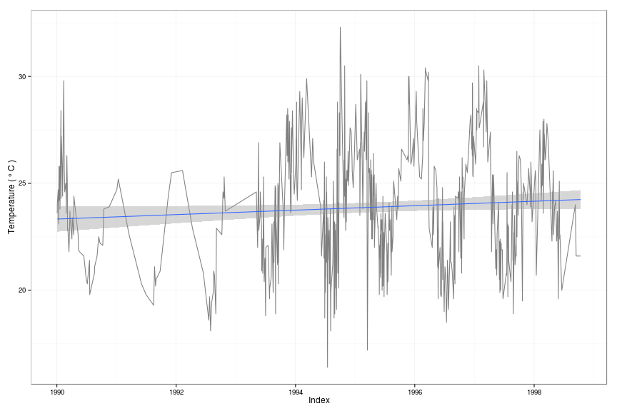
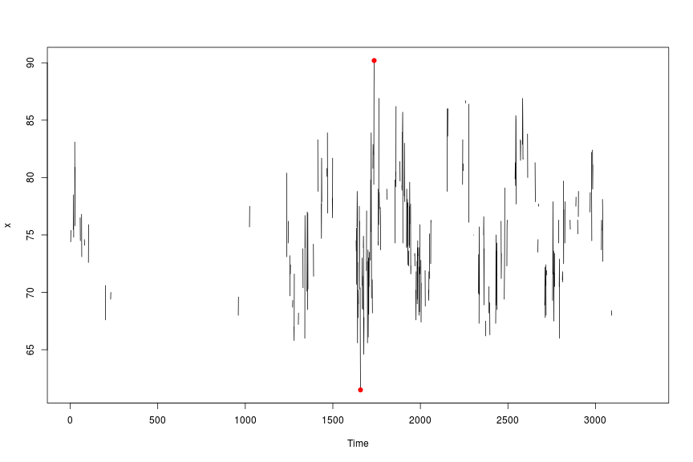
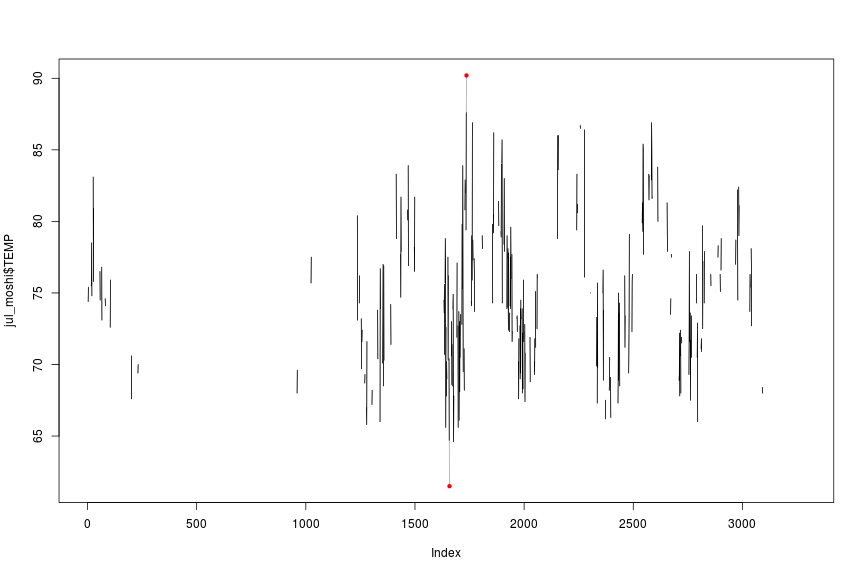

GSODTools
=========


For the latest stable release, please refer to  
[![doi_GSODTools_v1.0.0][1]][2].

## What it is all about

Every person dealing with long-term climatological data (e.g. of daily air temperature, relative humidity, and precipitation amounts) will sooner or later stumble across the Global Summary Of Day (GSOD) climate data collection provided by the National Oceanic and Atmospheric Association (NOAA). I've been recently looking for available GSOD stations in close vicinity to Mt. Kilimanjaro, Tanzania, and as I am trying to realize most of my coding work using R, I quickly noticed that there are only a few packages that provide convenient tools for processing GSOD data. Therefore, I started to write this package that includes both downloading data sets of selected climate stations for a given time span as well as some processing steps for quality assurance and gap filling.


## Data selection and download

### Getting started

The starting point for each GSOD-related search query is the selection of a 
particular station (or even multiple stations). Although a [GIS Data Locator][3] exists that allows interactive 
station selection and data acquisition, I thought it was a good thing to 
implement a couple of search function to speed things up a little bit. 

The **GSODTools** package comes with a built-in dataset from [NOAA's FTP server][4]
holding information about all available GSOD stations that is automatically 
attached via lazy-loading when loading the package. Let's have a quick look at it. 


```
##   USAF  WBAN STATION.NAME CTRY FIPS STATE CALL   LAT   LON ELEV..1M.    BEGIN      END
## 1 6852 99999         SENT   SW   SZ            46817 10350     14200       NA       NA
## 2 7005 99999   CWOS 07005                         NA    NA        NA 20120127 20120127
## 3 7010 99999   CWOS 07010                         NA    NA        NA       NA       NA
## 4 7011 99999   CWOS 07011                         NA    NA        NA 20111025 20121129
## 5 7012 99999   CWOS 07012                         NA    NA        NA       NA       NA
## 6 7015 99999   CWOS 07015                         NA    NA        NA       NA       NA
```

Unfortunatelly, the data formatting and consistency of this official table is 
rather poor. Hence, I thought it might be quite helpful to sort out some 
inconveniences above all else. The referring function is called *gsodReformat()* 
and allows to reformat elevation (decimeters to meters) as well as latitude and longitude
(thousandth of a degree to whole degree). Furthermore, it offers the opportunity
to remove invalid coordinates, i.e. values of latitude and longitude exceeding 
valid thresholds of +/-90 and +/-180 degrees, respectively. Optionally, the 
adjusted dataset can be converted to an object of class `sp` prior to return.

Consequently, the first lines of code working with **GSODTools** should probably 
look like this.


```r
# Reformat data and convert to spatial object
gsod_shp <- gsodReformat(data = gsodstations,
                         elevation = TRUE, 
                         coords = TRUE,
                         df2sp = TRUE)

par(mar = c(0, 0, 0, 0))
plot(gsod_shp)
```

 


### Selecting a station

Now that the list of available GSOD stations is in a reasonable format and holds
spatial information, the next step would be to select a station you would like to
download data from. Using the GIS Data Locator, this involves quite some clicking 
around until you finally reach the download page. **GSODTools** offers multiple 
functions to facilitate station selection and data acquisition, allowing the user
to select stations based on spatial characteristics or by hand. 

`stationFromCoords` takes a x (longitude) and y (latitude) coordinate as input, 
and returns all available GSOD stations that fall within a user-defined buffer
around that location. Alternatively, a 'SpatialPoints' object may be provided 
rather than two separate numerics. For instance, let's search for GSOD stations
in a circle of 500 km around Kibo summit, Mt. Kilimanjaro, Tanzania. The referring
coordinates are `c(37.359031, -3.065053)`.


```r
shp_kibo <- stationFromCoords(x = 37.359031, y = -3.065053, width = 500)
# or: stationFromCoords(x = c(37.359031, -3.065053), width = 500)
# or: stationFromCoords(x = SpatialPoints(data.frame(x = 37.359031, 
#                                                    y = -3.065053), 
#                                         proj4string = CRS("+init=epsg:4326")), 
#                       width = 500)

mapGriddedData(mapRegion = "africa", plotData = FALSE, borderCol = "black",
               addLegend = FALSE)
points(shp_kibo, col = "red", pch = 20, cex = 2)
```

 

`stationFromExtent`, just like `stationFromCoords`, allows station selection 
based on spatial criteria. There are actually two options how to handle this 
function. If no bounding box is defined, the user is automatically prompted to 
manually draw an extent on a map rather than directly supplying specific 
coordinates. The advantage is that spatial selection is not performed in a 
circular shape, i.e. in a uniform distance around a given location, but depends 
on user preferences. With respect to the aforementioned example, this means that GSOD stations in the southern Mt. Kilimanjaro region could be selected rather than all stations in a given distance from the summit. 
Alternatively, an extent object from an arbitrary spatial object, e.g. 'RasterLayer', 
'SpatialPolygons' etc, may be defined. In this case, `drawExtent` (which is actually quite difficult to include in a README file) is automatically disabled. 


```r
bbox_kibo_south <- extent(c(36.6, 37.72, -3.5, -3.065053))
shp_kili_south <- stationFromExtent(bb = bbox_kibo_south)

mapGriddedData(mapRegion = "africa", plotData = FALSE, borderCol = "black",
               addLegend = FALSE)
points(shp_kili_south, col = "red", pch = 20, cex = 2)
```

 

The third and, at the moment, final possibility to select a GSOD station is to 
simply choose a name from the built-in station list. This is, however, a quite
tricky approach since you have to know the precise spelling of a station's name. 
Again referring to the above example where we selected Arusha, Moshi, and 
Kilimanjaro International Airport (KIA), this would more or less look like this. 


```r
library(dplyr)

station_names <- c("ARUSHA", "KILIMANJARO AIRPORT", "MOSHI")

shp_kili_south <- 
  gsodstations %>% 
  gsodReformat() %>% 
  filter(STATION.NAME %in% station_names) %>% 
  gsodDf2Sp()

shp_kili_south@data
```

```
##     USAF  WBAN        STATION.NAME CTRY FIPS STATE CALL ELEV..1M.    BEGIN      END
## 1 637890 99999              ARUSHA   TN   TZ       HTAR      1387 19600111 20130705
## 2 637900 99999               MOSHI   TN   TZ       HTMS       831 19490909 20130612
## 3 637910 99999 KILIMANJARO AIRPORT   TN   TZ       HTKJ       896 19730101 20130705
```


### Downloading data

Ideally, you have now found an appropriate station you would like to acquire 
data from. It usually takes some patience to click through the download procedure
inherent to the GIS Data Locator, and having to perform the same steps again and 
again can soon get quite frustrating. I implemented a function called 
`dlGsodStations` that helps to overcome these inconveniences. 
The function works with USAF codes that are unique to each GSOD station and, in 
my opinion, catchier than the associated station names. The USAF code can be 
determined by having a look at the outcome of the various station selection 
functions. 


```r
library(dplyr)

# Subset station list by name, and display related USAF code
moshi <- filter(gsodstations, STATION.NAME == "MOSHI")
head(moshi)
```

```
##     USAF  WBAN STATION.NAME CTRY FIPS STATE CALL   LAT   LON ELEV..1M.    BEGIN      END
## 1 637900 99999        MOSHI   TN   TZ       HTMS -3350 37333      8310 19490909 20130612
```

If you are not willing to download the entire dataset from a given 
station (which is the default setting), but rather a limited period of time, you 
can specify the desired years through `start_year` and `end_year`. It is 
possible to adjust the destination folder for data download (`dsn`) if you do 
not want to save the data in the current working directory. Furthermore, you can
also determine whether to extract the zipped files and remove the *.gz files
after extraction. In this case, the function returns a `data.frame` rather than
a vector of *.gz filepaths. Note that, for each year and station, the function 
automatically checks if data is already present in the specified destination 
folder. If so, the referring download will be skipped and the 
subsequent download query will be evaluated. Here is an example on data 
download including visualization of the daily mean air temperature from Moshi, 
Tanzania, for the years 1990 to 2000. 


```r
# Not run: Download data from Moshi, Tanzania, from 1990 to 1995
gsod_moshi <- dlGsodStations(usaf = moshi$USAF,
                             start_year = 1990, end_year = 2000,
                             dsn = paste0(getwd(), "/data/moshi/"),
                             unzip = TRUE)
```


```r
# Plot temperature data (but: time series not continuous!)
library(ggplot2)

# Remove obsolete columns
gsod_moshi <- gsod_moshi[, -grep("NC", names(gsod_moshi))]
# Reformat date and temperature column
gsod_moshi$YEARMODA <- as.Date(strptime(gsod_moshi$YEARMODA, format = "%Y%m%d"))
gsod_moshi$TEMP <- toCelsius(gsod_moshi$TEMP, digits = 1)

ggplot(aes(y = TEMP, x = YEARMODA), data = gsod_moshi) + 
  geom_line(color = "grey50") + 
  stat_smooth(method = "lm") + 
  labs(x = "Index", y = expression("Temperature (" ~ degree ~ C ~ ")")) +
  theme_bw()
```

 


### Side note: `toCelsius`

You may have already noticed `toCelsius` in the preceding code chunk. Indeed, 
this function is as small as useful, as it converts temperature values from 
degree Fahrenheit (which is native GSOD format) to degree Celsius. 


```r
# RNG
set.seed(10)

# Degree Fahrenheit
val_fah <- runif(10, 60, 80)
# -> Degree Celsius
toCelsius(val_fah, digits = 1)
```

```
##  [1] 21.2 19.0 20.3 23.3 16.5 18.1 18.6 18.6 22.4 20.3
```


## Data processing

So much for the generally applicable part of **GSODTools**, that is intended to
facilitate station selection and data download. The upcoming part of this short 
introduction focuses on data reformatting, outlier removal, and multi-step 
imputation of missing data based on linear interpolation,
multivariate regression, and time-series analysis. Most of the functions work 
with objects of class 'ki.data' that has been invented in the context of 
[JULENDAT Utilities for Environmental Data][5]. Nonetheless, I tried to implement
compatibility to ordinary R-base classes whenever possible, and hence, one or 
two of you might discover something useful in the upcoming functions. 


### Reformatting

The JULENDAT framework is based on unitary data formatting conventions. Besides 
the measurement values, a number of additional columns is included holding 
information about timezone, aggregation time, various station IDs, processing 
level, and quality flag related to the JULENDAT processing chain. External users
may enter referring information, or just ignore those columns, or simply not 
execute `gsod2ki` at all. Anyway, if you are willing to adopt those conventions, 
here is a short "How-To" based on the previously downloaded Moshi data. Note 
that a dataset with continuous time steps will be generated from the initial
data, meaning that missing daily records will be filled with "NA". 


```r
gsod_moshi <- dlGsodStations(usaf = moshi$USAF,
                             start_year = 1990, end_year = 2000,
                             dsn = paste0(getwd(), "/data/moshi/"),
                             unzip = TRUE)
```


```r
jul_moshi <- gsod2ki(data = gsod_moshi, 
                     prm_col = c("TEMP", "MIN", "MAX"))
head(jul_moshi)
```

```
##              Datetime Timezone Aggregationtime PlotId EpPlotId StationId Processlevel Qualityflag TEMP  MIN  MAX
## 1 1990-01-01 12:00:00       NA            -999     NA      xxx        NA         -999          NA   NA   NA   NA
## 2 1990-01-02 12:00:00       NA            -999     NA      xxx        NA         -999          NA   NA   NA   NA
## 3 1990-01-03 12:00:00       NA            -999     NA      xxx        NA         -999          NA 74.4 63.0 84.2
## 4 1990-01-04 12:00:00       NA            -999     NA      xxx        NA         -999          NA 75.4 59.9 84.2
## 5 1990-01-05 12:00:00       NA            -999     NA      xxx        NA         -999          NA   NA   NA   NA
## 6 1990-01-06 12:00:00       NA            -999     NA      xxx        NA         -999          NA   NA   NA   NA
```


### Outlier removal

The continuous time series created from `gsod2ki` is an easy-to-handle input for
further processing steps related to outlier removal and imputation of missing 
data. Indeed, one crucial step to improve the consistency of GSOD datasets 
is to get rid of freak values. Experience has shown that these 
tend to occur at least at East African stations every now and then. Therefore, I adopted
an approach suggested by [Rob Hyndman on StackOverflow][6] that is based on 
thresholds calculated from upper and lower quantile criteria. 
The corresponding function is called `tsOutliers`. It may be used if you would like to 
visualize values identified as statistical outliers based on the defined upper 
and lower quantile limit. If `index = TRUE`, it returns the outlier indices, 
else a numeric vector holding calculated scores for each measurement value.


```r
# Visualization of statistical outliers
outlier_id <- 
  tsOutliers(jul_moshi$TEMP, lower_quantile = .25, upper_quantile = .75,
             plot = TRUE, index = TRUE)
```

 

`outlier2na` is a wrapper function around `gsod2ki` and incorporates slight
enhancements as it automatically replaces freak values with "NA". Still, it 
allows the visualization of identified outliers by passing `plot = TRUE` (which 
will not be performed now, but is good to know anyway).  


```r
# Rejection of statistical outliers 
val <- outlier2na(jul_moshi$TEMP, lower_quantile = .25, upper_quantile = .75)

# Original time series
plot(jul_moshi$TEMP, col = "grey65", type = "l")
# Time series with outliers removed
lines(val)
# Outliers
points(outlier_id, jul_moshi$TEMP[outlier_id], col = "red", pch = 20)
```

 

[1]: https://zenodo.org/badge/5994/environmentalinformatics-marburg/GSODTools.png
[2]: http://dx.doi.org/10.5281/zenodo.12217
[3]: http://www.climate.gov/daily-observational-data-global-summary-day-gsod-%E2%80%93-gis-data-locator
[4]: ftp://ftp.ncdc.noaa.gov/pub/data/gsod/ish-history.csv
[5]: https://code.google.com/p/julendat/
[6]: http://stats.stackexchange.com/questions/1142/simple-algorithm-for-online-outlier-detection-of-a-generic-time-series
